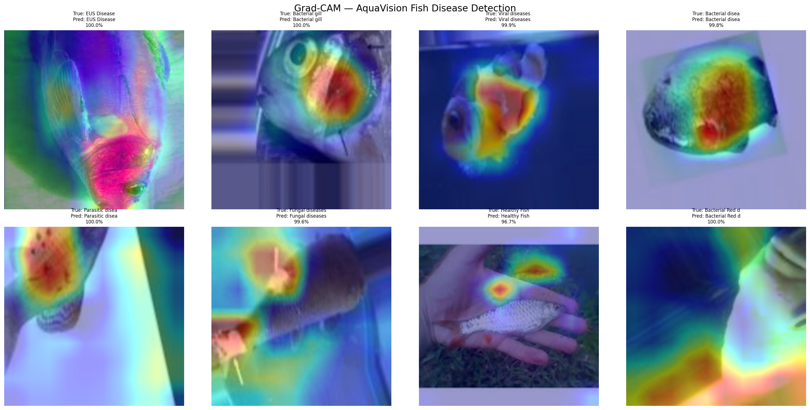

# 🐟 AquaVision

**AI-powered disease detection for aquaculture farmers.**

---

## What It Does

Upload a photo of your shrimp or fish → instant disease detection:

- Disease identification with confidence score
- Severity level (None / Moderate / Critical)
- Top-3 predictions
- Recommended action for farmers

---

## Live Demo

👉 **[aquavision-detect.streamlit.app](https://aquavision-detect.streamlit.app)**

---

## Sample Images
Test images available in the [`samples/`](samples/) folder — upload directly into the app to try it out.

## Diseases Detected

### 🦐 Shrimp (4 classes)

| Disease | Description | Severity |
|---|---|---|
| Healthy | No disease detected | None |
| BG | Black Gill Disease | Moderate |
| WSSV | White Spot Syndrome Virus | Critical |
| WSSV_BG | Combined WSSV + Black Gill | Critical |

### 🐟 Fish (8 classes)

| Disease | Description | Severity |
|---|---|---|
| Healthy Fish | No disease detected | None |
| Bacterial Red Disease | Bacterial infection, reddening of body | Moderate |
| Aeromoniasis | Aeromonas bacterial disease, hemorrhaging | Moderate |
| Bacterial Gill Disease | Gill infection, breathing difficulty | Moderate |
| EUS Disease | Epizootic Ulcerative Syndrome, deep ulcers | Critical |
| Saprolegniasis | Fungal infection, cotton-like growth | Moderate |
| Parasitic Diseases | Parasitic infection of skin/gills | Moderate |
| White Tail Disease | Viral disease, high mortality in juveniles | Critical |

---

## Model Performance

| Model | Architecture | Classes | Val Accuracy | Test Accuracy |
|---|---|---|---|---|
| Shrimp | EfficientNetB0 | 4 | 85% | — |
| Fish | EfficientNetB3 | 8 | 82.2% | 97% |

---

## Model Explainability — Grad-CAM

The model correctly focuses on diseased regions of the fish:

Red/yellow areas show where the model focused to make each prediction. This confirms the model is learning actual disease features, not background artifacts.

---

## Tech Stack

| Component | Technology |
|---|---|
| Models | EfficientNetB0 / EfficientNetB3 |
| Export | ONNX (no TensorFlow at inference) |
| Training | Google Colab T4 GPU |
| App | Streamlit |
| Deployment | Streamlit Cloud |

---

## Known Limitations

- Best performance on clear, isolated photos with good lighting
- Real farm photos with mud, poor lighting, or multiple subjects may show lower confidence
- Fix in progress: collecting real farm data for fine-tuning

---

## Roadmap

- [x] Shrimp disease detection (85% val accuracy)
- [x] Fish disease detection (82.2% val / 97% test accuracy)
- [x] Top-3 predictions with confidence scores
- [x] Severity classification (None / Moderate / Critical)
- [x] Model explainability via Grad-CAM
- [x] Mobile-friendly UI
- [ ] Real farm photo fine-tuning
- [ ] Growth stage classification
- [ ] Mobile app

---

## Built By

**Mahesh Penubothu**  
Integrated M-Tech CSE · VIT-AP University  
